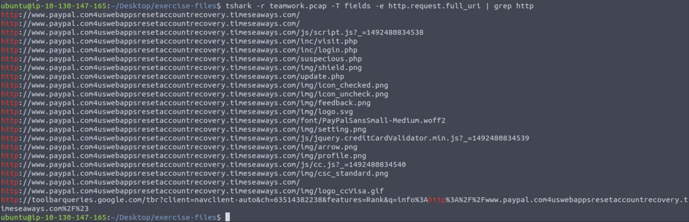
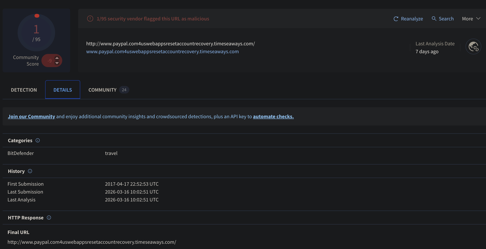
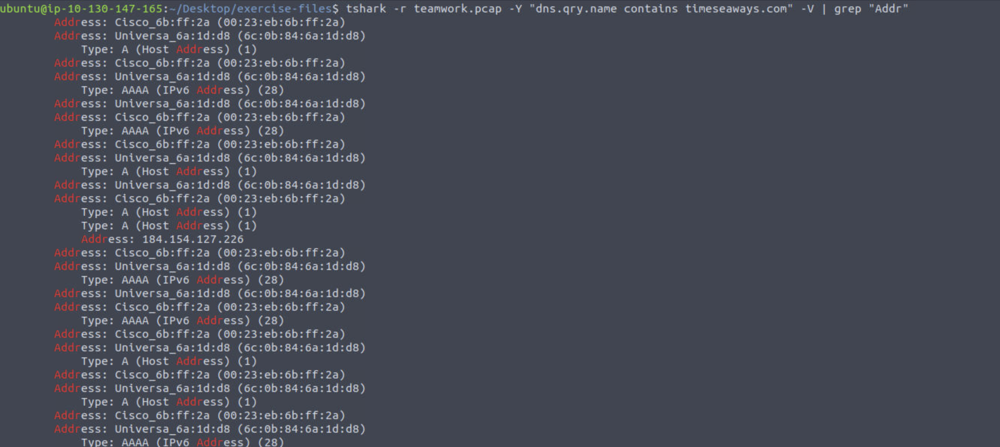
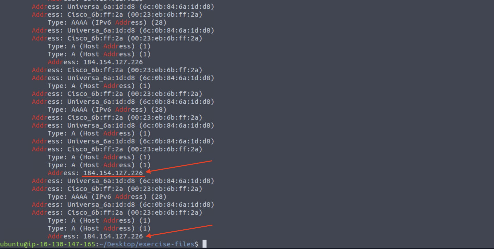
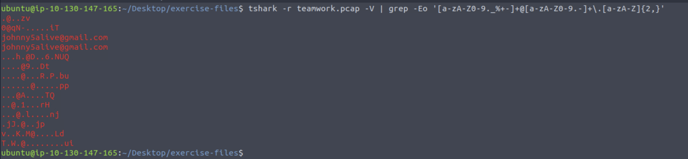

# TryHackMe: Tshark Challenge I: Teamwork

## Introduction 

This room presents you with a challenge to investigate some traffic data as a part of the SOC team. Let's start working with TShark to analyse the captured traffic. We recommend completing the TShark: The Basics and TShark: CLI Wireshark Features rooms first, which will teach you how to use the tool in depth. 
Start the VM by pressing the green Start Machine button attached to this task. The machine will start in split view, so you don't need SSH or RDP. In case the machine does not appear, you can click the blue Show Split View button located at the top of this room.

NOTE: Exercise files contain real examples. DO NOT interact with them outside of the given VM. Direct interaction with samples and their contents (files, domains, and IP addresses) outside the given VM can pose security threats to your machine. 

## Case: Teamwork!

An alert has been triggered: "The threat research team discovered a suspicious domain that could be a potential threat to the organisation."

__Answer the questions below__

*Investigate the contacted domains.
Investigate the domains by using VirusTotal.
According to VirusTotal, there is a domain marked as malicious/suspicious*

### What is the full URL of the malicious/suspicious domain address?

*Enter your answer in defanged format.*

We need to extract the domain information, so we issue the following command:  

tshark -r teamwork.pcap -T fields -e http.request.full_uri

This command reads the PCAP file and extracts the full HTTP request URIs from each packet.  
The `-T fields` option tells TShark to output specific fields instead of full packet details, and `-e http.request.full_uri` selects the full request URI (including the domain and path), allowing us to quickly identify the domains being contacted.

The output contains a lot of empty lines, as not every packet includes an HTTP request.  
We can easily clean this up by filtering valid entries using grep:  

tshark -r teamwork.pcap -T fields -e http.request.full_uri | grep "http://"

We see the URL, now we go to [CyberChef](https://gchq.github.io/CyberChef/) to defang it 

**Answer: hxxp[://]www[.]paypal[.]com4uswebappsresetaccountrecovery[.]timeseaways[.]com/**

### When was the URL of the malicious/suspicious domain address first submitted to VirusTotal?

We copy-paste the URL in virustotal, go to the details tab, and we see the date of first submission: 

**Answer: 2017-04-17 22:52:53 UTC**

### Which known service was the domain trying to impersonate?

We see this from the URL: http://www.paypal.com4uswebappsresetaccountrecovery.timeseaways.com/

**Answer: paypal**

### What is the IP address of the malicious domain?

*Enter your answer in defanged format*

To get the IP address of the malicious domain, we need to examine the DNS traffic  
DNS is responsible for resolving domain names into IP addresses, so the mapping we are looking for will be found in the DNS query/response exchange  

Specifically, the IP address is contained in the DNS response, within the "Answer" section, where the domain is mapped to its corresponding IP address  

We can therefore filter for DNS packets related to the malicious domain and inspect their contents to retrieve the resolved IP:  
tshark -r teamwork.pcap -Y "dns.qry.name contains timeseaways.com" -V | grep "Addr"

We have our IP address  
Defang if using [CyberChef](https://gchq.github.io/CyberChef/) again

**Answer: 184[.]154[.]127[.]226**

### What is the email address that was used?

*Enter your answer in defanged format. (format: aaa[at]bbb[.]ccc)*

To identify the email address used, we inspect HTTP POST requests, as these typically contain user-submitted data such as login credentials.

We can extract potential email addresses directly from the packet data using:

tshark -r teamwork.pcap -V | grep -Eo '[a-zA-Z0-9._%+-]+@[a-zA-Z0-9.-]+\.[a-zA-Z]{2,}'

This command searches the verbose packet output for patterns matching email addresses

From the output, we identify the following email:

**Answer: johnny5alive[at]gmail[.]com**
