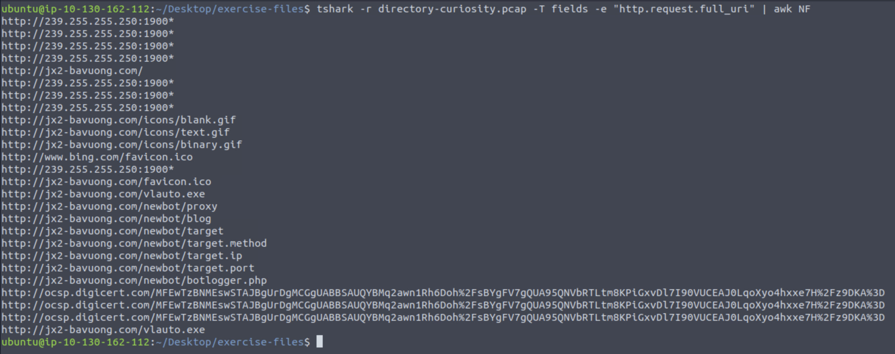
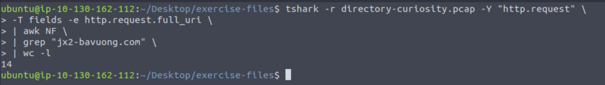
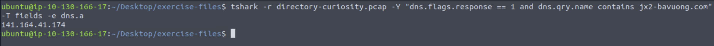

# TShark Challenge II: Directory  

This room presents you with a challenge to investigate some traffic data as a part of the SOC team. Let's start working with TShark to analyse the captured traffic. We recommend completing the TShark: The Basics and TShark: CLI Wireshark Features rooms first, which will teach you how to use the tool in depth.

Start the VM by pressing the green Start Machine button in this task. The machine will start in split view, so you don't need SSH or RDP. In case the machine does not appear, you can click the blue Show Split View button located at the top of this room.

NOTE: Exercise files contain real examples. DO NOT interact with them outside of the given VM. Direct interaction with samples and their contents (files, domains, and IP addresses) outside the given VM can pose security threats to your machine. 

**An alert has been triggered:** "A user came across a poor file index, and their curiosity led to problems".

The case was assigned to you. Inspect the provided directory-curiosity.pcap located in ~/Desktop/exercise-files and retrieve the artefacts to confirm that this alert is a true positive.

Your tools: TShark, VirusTotal(opens in new tab.

**Answer the questions below**

*Investigate the DNS queries.
Investigate the domains by using VirusTotal.
According to VirusTotal, there is a domain marked as malicious/suspicious.*

### What is the name of the malicious/suspicious domain?
*Enter your answer in a defanged format.*  

To identify potentially malicious domains, we first need to analyze the DNS traffic. That will tell us which domains the victim attempted to resolve, which are a main source of suspicious activity   

Since a capture contains both DNS queries and responses, we will filter specifically for DNS query packets. To do that, we will use the filter dns.flags.response == 0, which isolates only query packets (as opposed to responses)  

In order to visualize the queried domain names, we can use TShark’s field output functionality, focusing on the dns.qry.name field:  

tshark -r directory-curiosity.pcap -Y "dns.flags.response == 0" -T fields -e dns.qry.name  

Defang it using [Cyberchef](https://gchq.github.io/CyberChef/)

**Answer: jx2-bavuong[.]com**

### What is the total number of HTTP requests sent to the malicious domain?

To investigate HTTP activity related to the malicious domain, we first need to extract all HTTP requests from the capture. HTTP requests represent outbound communication initiated by the client and can reveal interactions with suspicious infrastructure.  

To isolate only HTTP request packets, we apply the display filter http.request. We then use TShark’s field output functionality to extract the full requested URIs via the http.request.full_uri field:  

tshark -r directory-curiosity.pcap -Y "http.request" -T fields -e http.request.full_uri

The output contains too many empty lines due to packets that do not include the specified field. To clean the output, we remove blank lines using awk NF  

Next, we filter for requests targeting the identified malicious domain (jx2-bavuong.com) using grep. Finally, we count the total number of matching requests with wc -l, which gives us the number of HTTP requests sent to the malicious domain  

tshark -r directory-curiosity.pcap -Y "http.request" -T fields -e http.request.full_uri awk NF grep "jx2-bavuong.com" wc -l

**Answer: 14**

### What is the IP address associated with the malicious domain?
*Enter your answer in a defanged format.*

To determine the IP address associated with the malicious domain, we need to analyze the DNS response traffic. While DNS queries show which domains were requested, DNS responses contain the actual resolved IP addresses.  

To isolate this information, we filter for DNS response packets using dns.flags.response == 1 and match only those related to the malicious domain (jx2-bavuong.com). We then extract the corresponding IPv4 address using the dns.a field, as DNS A records map a domain to its IPv4 address.  

tshark -r directory-curiosity.pcap -Y "dns.flags.response == 1 and dns.qry.name contains jx2-bavuong.com" -T fields -e dns.a

Defang using [Cyberchef](https://gchq.github.io/CyberChef/)

**Answer: 141[.]164[.]41[.]174**
