# TryHackMe: Wireshark – Traffic Analysis

## Task 2: Nmap Scans

### What is the total number of "TCP Connect" scans?
The Nmap flag for a TCP connect scan is "-sT".
A connect scan initiates the TCP connection but does not complete the full handshake. It sends a SYN packet, examines the reply, then terminates the connection.

So a SYN packet is sent, but the corresponding ACK message is never received. The packets also have a window size larger than 1024 bytes.

Let's try this filter:

tcp.flags.syn == 1 and tcp.flags.ack == 0 and tcp.window_size > 1024

### 1000 packets are returned, and that's the correct answer

### Which scan type is used to scan the TCP port 80?

The task tells us this:

**Answer:** TCP connect 

### How many "UDP close port" messages are there?

The task tells us this too: 

**Answer:** 1083 

### Which UDP port in the 55-70 port range is open?

Let's set a filter to check for UDP ports in the 55–70 range 

udp.port >= 55 and udp.port <= 70

**Answer:** 48

## Task 3: ARP Poisoning & Man In The Middle!

### What is the number of ARP requests crafted by the attacker?

We know that the ARP request opcode is 1  
We also know the attacker's MAC address from the task, so we can filter based on that:

arp.opcode == 1 && arp.src.hw_mac == 00:0c:29:e2:18:b4

**Answer:** 284

### What is the number of HTTP packets received by the attacker?

We can filter by protocol and using the attacker's MAC address 
http and eth.addr == 00:0c:29:e2:18:b4

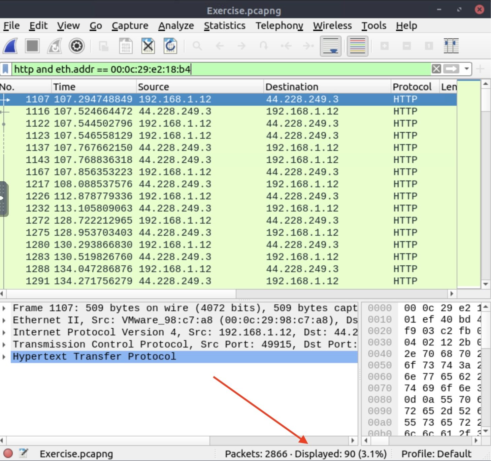

**Answer: 90**

### What is the number of sniffed username&password entries?

We know that we need to look for **POST requests**, since login credentials are typically submitted through HTTP POST forms

This one took a while for me to figure out

I started by applying this filter:

http.request.method == POST and eth.dst == 00:0c:29:e2:18:b4

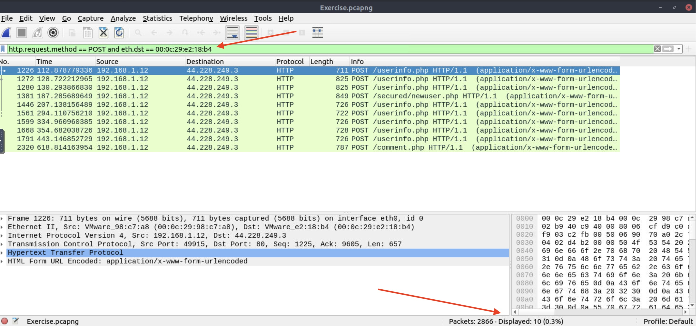

However, 10 is not the correct answer.

Inspecting the POST requests further, we notice that the relevant fields contain "uname", so we can filter for that 
This returns 7 packets, but that is still not the correct answer.

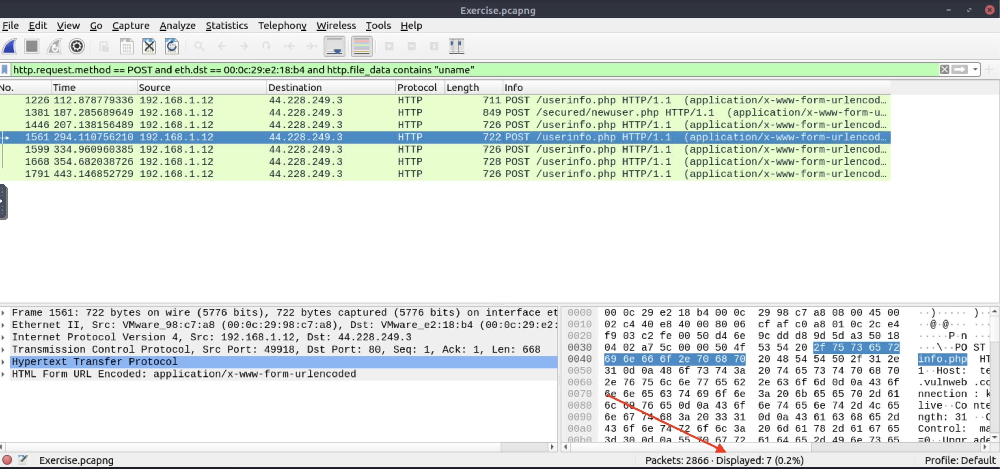

At this point, it appears that only the **POST requests to `/userinfo.php`** are relevant, so we refine the filter:

http.request.full_uri == "http://testphp.vulnweb.com/userinfo.php" &&
http.request.method == POST &&
urlencoded-form contains "uname"

This returns 6 packets, which correspond to the sniffed username and password entries.

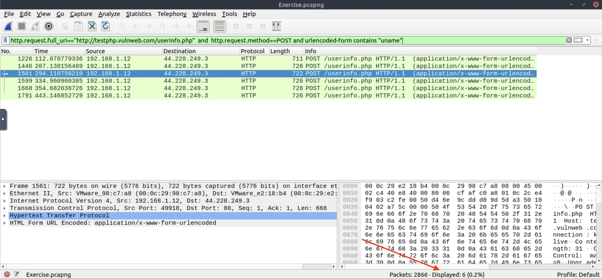

**Answer: 6**

### What is the password of the "Client986"?

Keeping the filter we just used, double-click packet 1668, and go to HTML Form URL encoded

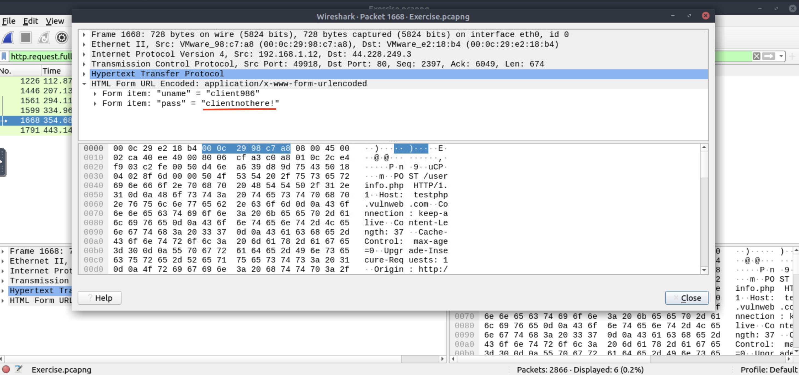

**Answer: clientnothere!**

### What is the comment provided by the "Client354"?

We're looking for POST requests again, we get 10 packets by filtering for those 

http.request.method == POST

The only suspect entry is the comment.php one

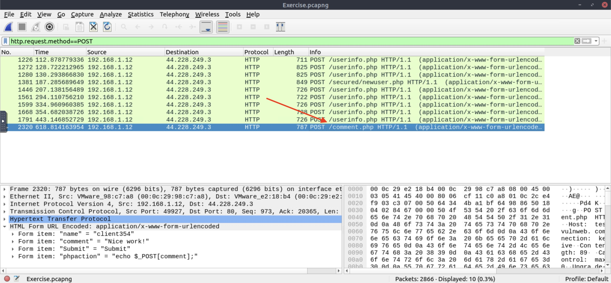

Sure enough, we select it, and we see our answer there

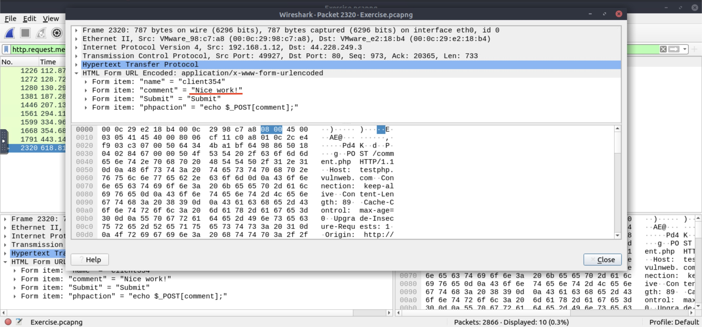

**Answer: Nice work!**

## Task 4: Identifying Hosts: DHCP, NetBIOS and Kerberos

### What is the MAC address of the host "Galaxy A30"?

My first move was probably the most predictable one

Using the filter:

dhcp.option.hostname contains "Galaxy A30"

yielded no results, so I broadened the search to:

dhcp.option.hostname contains "Galaxy"

This returns three packets. Two of them correspond to the broadcast address of the local network segment, leaving only one relevant packet

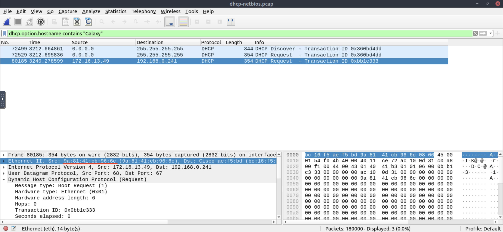

**Answer:** 9a:81:41:cb:96:6c

### How many NetBIOS registration requests does the "LIVALJM" workstation have?

First thing we need to do is narrow down the research:
nbns.name contains LIVALJM

40 packets are returned, we're only interested in those with a registration value in them

One common denominator those packets seem to have are two flags with the value of 0x2810 and 0x2910 respectively, so let's filter by those 
nbns.name contains "LIVALJM" and nbns.flags in {0x2810 0x2910}

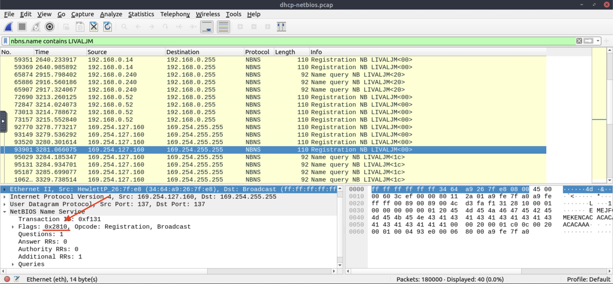

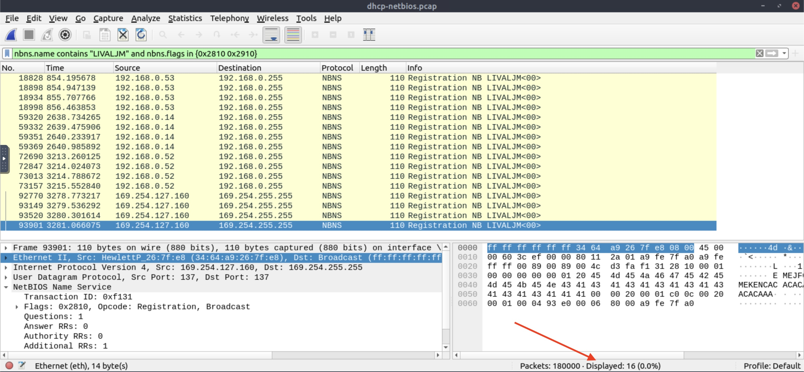

**Answer: 16**

### Which host requested the IP address "172.16.13.85"?

The task basically gives us the answer, so we use the filter:

dhcp.option.requested_ip_address == 172.16.13.85

ONE packet is returned 

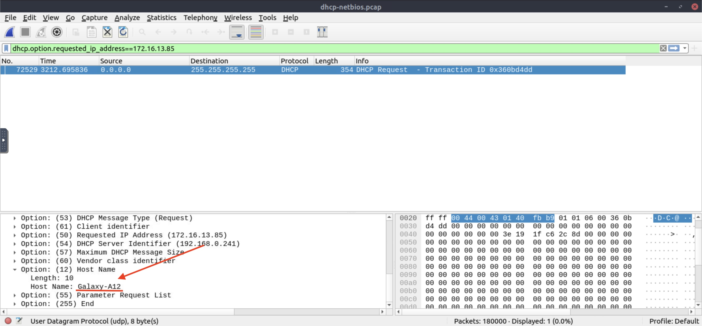

**Answer: Galaxy A-12**

### What is the IP address of the user "u5"? (Enter the address in defanged format.)

As the task suggests –> kerberos.CNameString == "u5"

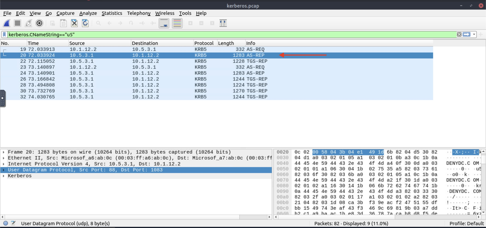

Use [Cyberchef](https://gchq.github.io/CyberChef/) to defang it

**Answer: 10[.]1[.]12[.]2**

### What is the hostname of the available host in the Kerberos packets?

Once again, the task comes to our aid

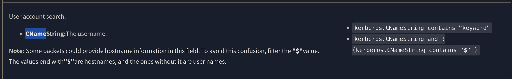

We issue: kerberos.CNameString contains "$" and we get one result 

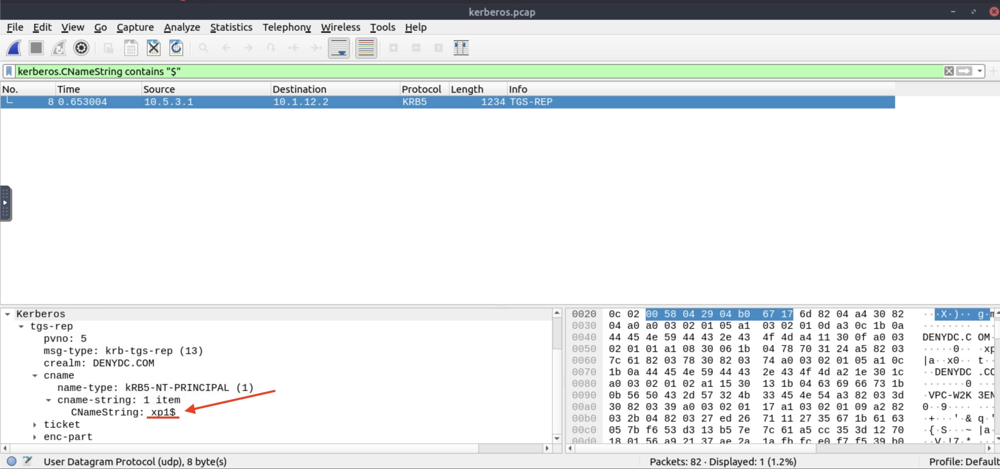

**Answer: xp1$**
