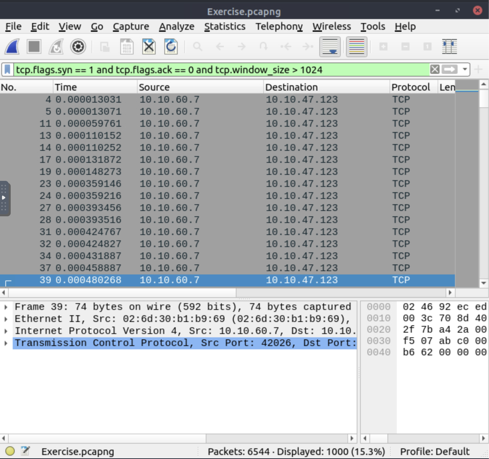
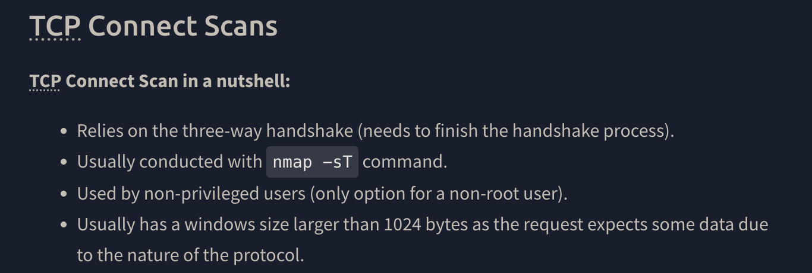
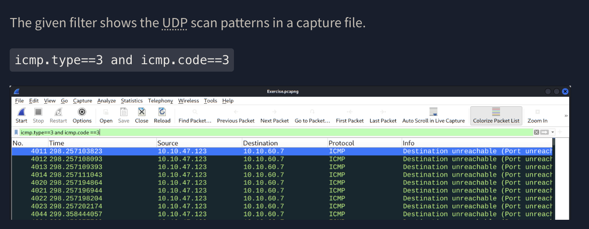
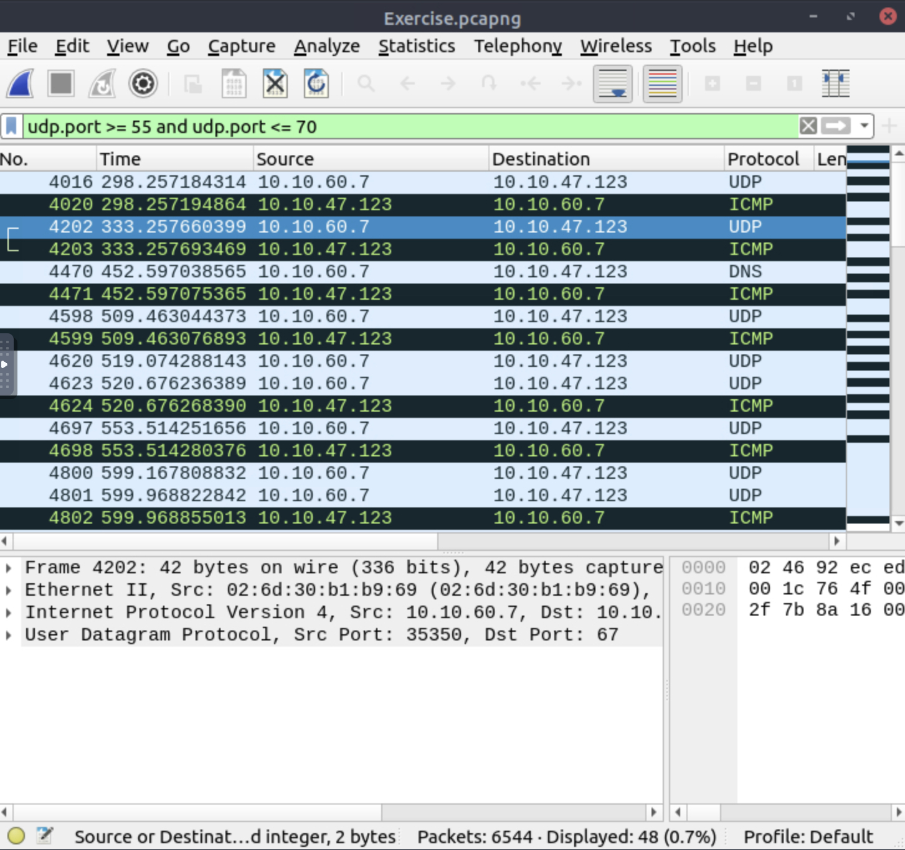
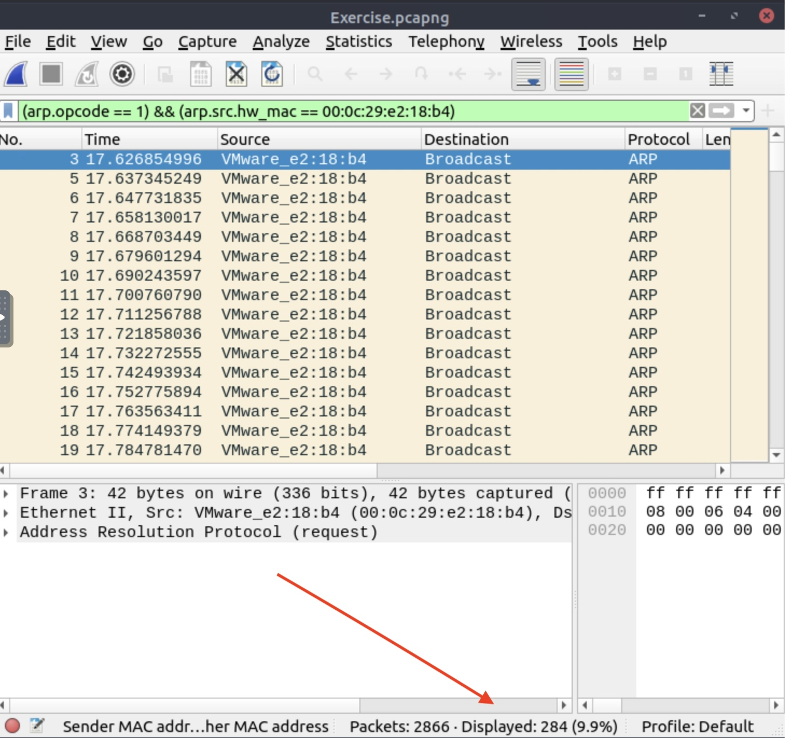

# TryHackMe: Wireshark – Traffic Analysis

## Task 2: Nmap Scans

### What is the total number of "TCP Connect" scans?
The Nmap flag for a TCP connect scan is "-sT".
A connect scan initiates the TCP connection but does not complete the full handshake. It sends a SYN packet, examines the reply, then terminates the connection.

So a SYN packet is sent, but the corresponding ACK message is never received. The packets also have a window size larger than 1024 bytes.

Let's try this filter:

tcp.flags.syn == 1 and tcp.flags.ack == 0 and tcp.window_size > 1024

### 1000 packets are returned, and that's the correct answer

### Which scan type is used to scan the TCP port 80?

The task tells us this:

**Answer:** TCP connect 

### How many "UDP close port" messages are there?

The task tells us this too: 

**Answer:** 1083 

### Which UDP port in the 55-70 port range is open?

Let's set a filter to check for UDP ports in the 55–70 range 

udp.port >= 55 and udp.port <= 70

**Answer:** 48

## Task 3: ARP Poisoning & Man In The Middle!

### What is the number of ARP requests crafted by the attacker?

We know that the ARP request opcode is 1  
We also know the attacker's MAC address from the task, so we can filter based on that:

arp.opcode == 1 && arp.src.hw_mac == 00:0c:29:e2:18:b4

**Answer:** 284

