# TryHackMe: Wireshark – Traffic Analysis

## Task 2: Nmap Scans

### What is the total number of "TCP Connect" scans?
The Nmap flag for a TCP connect scan is "-sT".
A connect scan initiates the TCP connection but does not complete the full handshake. It sends a SYN packet, examines the reply, then terminates the connection.

So a SYN packet is sent, but the corresponding ACK message is never received. The packets also have a window size larger than 1024 bytes.

Let's try this filter:

tcp.flags.syn == 1 and tcp.flags.ack == 0 and tcp.window_size > 1024

### 1000 packets are returned, and that's the correct answer

### Which scan type is used to scan the TCP port 80?

The task tells us this:

**Answer:** TCP connect 

### How many "UDP close port" messages are there?

The task tells us this too: 

**Answer:** 1083 

### Which UDP port in the 55-70 port range is open?

Let's set a filter to check for UDP ports in the 55–70 range 

udp.port >= 55 and udp.port <= 70

**Answer:** 48

## Task 3: ARP Poisoning & Man In The Middle!

### What is the number of ARP requests crafted by the attacker?

We know that the ARP request opcode is 1  
We also know the attacker's MAC address from the task, so we can filter based on that:

arp.opcode == 1 && arp.src.hw_mac == 00:0c:29:e2:18:b4

**Answer:** 284

### What is the number of HTTP packets received by the attacker?

We can filter by protocol and using the attacker's MAC address 
http and eth.addr == 00:0c:29:e2:18:b4

**Answer: 90**

### What is the number of sniffed username&password entries?

We know that we need to look for **POST requests**, since login credentials are typically submitted through HTTP POST forms

This one took a while for me to figure out

I started by applying this filter:

http.request.method == POST and eth.dst == 00:0c:29:e2:18:b4

However, 10 is not the correct answer.

Inspecting the POST requests further, we notice that the relevant fields contain "uname", so we can filter for that 
This returns 7 packets, but that is still not the correct answer.

At this point, it appears that only the **POST requests to `/userinfo.php`** are relevant, so we refine the filter:

http.request.full_uri == "http://testphp.vulnweb.com/userinfo.php" &&
http.request.method == POST &&
urlencoded-form contains "uname"

This returns 6 packets, which correspond to the sniffed username and password entries.

**Answer: 6**

### What is the password of the "Client986"?

Keeping the filter we just used, double-click packet 1668, and go to HTML Form URL encoded

**Answer: clientnothere!**

### What is the comment provided by the "Client354"?

We're looking for POST requests again, we get 10 packets by filtering for those 

http.request.method == POST

The only suspect entry is the comment.php one

Sure enough, we select it, and we see our answer there

**Answer: Nice work!**

## Task 4: Identifying Hosts: DHCP, NetBIOS and Kerberos

### What is the MAC address of the host "Galaxy A30"?

My first move was probably the most predictable one

Using the filter:

dhcp.option.hostname contains "Galaxy A30"

yielded no results, so I broadened the search to:

dhcp.option.hostname contains "Galaxy"

This returns three packets. Two of them correspond to the broadcast address of the local network segment, leaving only one relevant packet

**Answer:** 9a:81:41:cb:96:6c

### How many NetBIOS registration requests does the "LIVALJM" workstation have?

First thing we need to do is narrow down the research:
nbns.name contains LIVALJM

40 packets are returned, we're only interested in those with a registration value in them

One common denominator those packets seem to have are two flags with the value of 0x2810 and 0x2910 respectively, so let's filter by those 
nbns.name contains "LIVALJM" and nbns.flags in {0x2810 0x2910}

**Answer: 16**

### Which host requested the IP address "172.16.13.85"?

The task basically gives us the answer, so we use the filter:

dhcp.option.requested_ip_address == 172.16.13.85

ONE packet is returned 

**Answer: Galaxy A-12**

### What is the IP address of the user "u5"? (Enter the address in defanged format.)

As the task suggests –> kerberos.CNameString == "u5"

Use [Cyberchef](https://gchq.github.io/CyberChef/) to defang it

**Answer: 10[.]1[.]12[.]2**

### What is the hostname of the available host in the Kerberos packets?

Once again, the task comes to our aid

We issue: kerberos.CNameString contains "$" and we get one result 

**Answer: xp1$**

## Task 5: Tunneling Traffic: DNS and ICMP

### Investigate the anomalous packets. Which protocol is used in ICMP tunnelling?

### ICMP Overview

ICMP (Internet Control Message Protocol) is used by network devices to send **error messages and diagnostic information** — not actual data like TCP or UDP.

You can think of it as the troubleshooting protocol *par excellence*.

Tools like ping and traceroute rely on ICMP. Ping works by sending ICMP echo request messages and receiving echo replies.  

When analyzing traffic, ICMP can quickly tell us:
- whether a host is alive  
- if packets are failing to reach their destination  
- how traffic is moving across the network  

While it doesn’t carry data itself, it can provide us with useful information about the devices we are trying to communicate with.

### DNS analysis overview 

Adversary often sets up a domain address and configures it as a C2 channel and the commands executed post-exploitation send DNS queries to the C2 server. One way to recognize these queries is that they are longer than default length. 

### Use the "Desktop/exercise-pcaps/dns-icmp/icmp-tunnel.pcap" file. Investigate the anomalous packets. Which protocol is used in ICMP tunnelling?

It took some trial and error of looking at the raw data of various packets, but I finally got it:

**Answer: SSH**

### Use the "Desktop/exercise-pcaps/dns-icmp/dns.pcap" file.Investigate the anomalous packets. What is the suspicious main domain address that receives anomalous DNS queries? (Enter the address in defanged format.)

Let’s try: dns.qry.name.len > 15 and !mdns
(which is the task's recommended filter)  
But that returned 30k packets, that’s not gonna help us

After rummaging in vain among the returned packets, I asked [Echo](https://tryhackme.com/echo) for a way to get a cleaner output, and he recommended this filter: 
dns.qry.name.len > 15 and !mdns and dns.qry.type == 5 

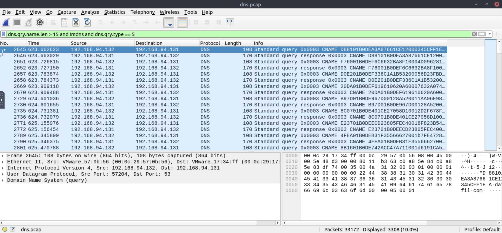

That returned 3308 packets – still messy, but the packets all look very similar  
Pick a random packet, go to Follow –> UDP Stream

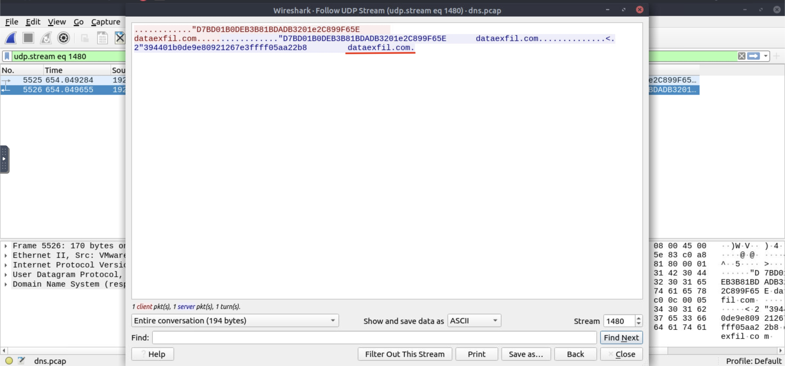

Back to Cyberchef to defang it

**Answer: dataexfil[.]com**

## Task 6: Cleartext Protocol Analysis: FTP

### How many incorrect login attempts are there?

The task basically gave us the answer:
ftp.response.code == 530

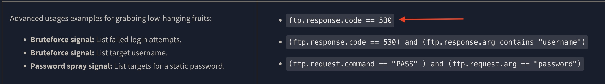

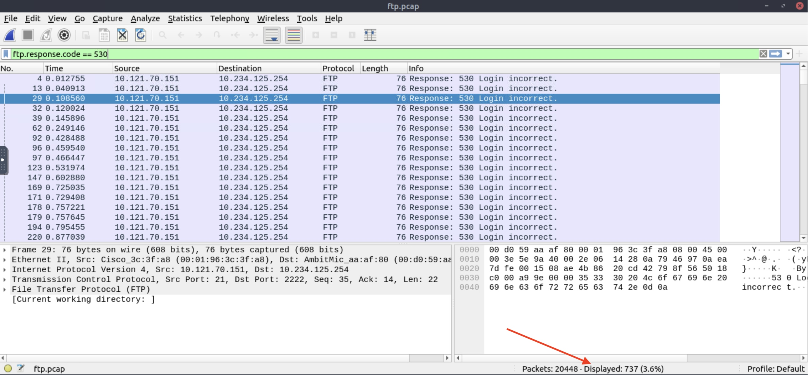

**Answer: 737**

### What is the size of the file accessed by the "ftp" account?

First I tried this filter: ftp.request.arg contains "ftp" && (ftp.request.command == "LIST" || ftp.request.command == "CWD")  
But no packets are returned

Since the 213 code indicates file status, I try: ftp.request.arg contains "ftp" and ftp.response.code == 213  
Still nothing 

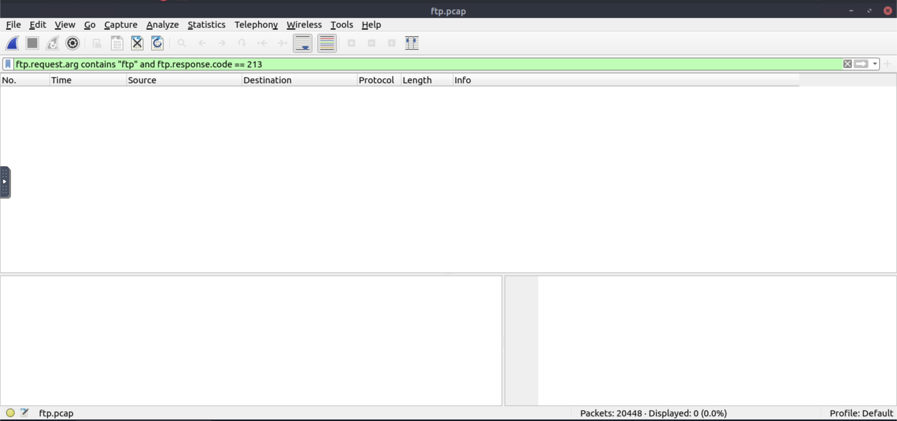

Finally I try: ftp.request.arg contains "ftp" or ftp.response.code == 213  
4 packets are displayed, 2 of them contain a 213 response 

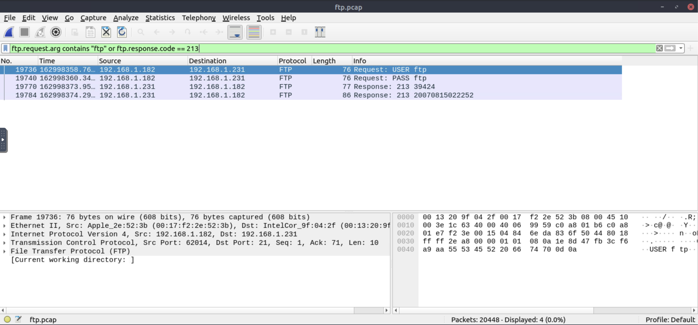

**Answer: 39424**

### The adversary uploaded a document to the FTP server. What is the filename?

Simply follow the TCP stream of the packet we got from the last answer

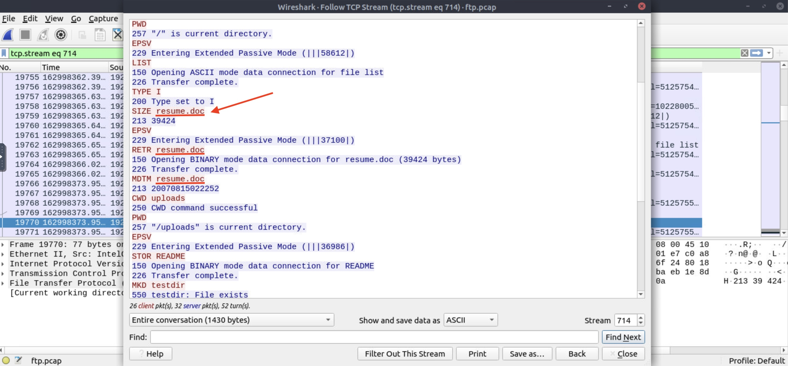

**Answer: resume.doc**

### The adversary tried to assign special flags to change the executing permissions of the uploaded file. What is the command used by the adversary?

We get this info from the same data stream 

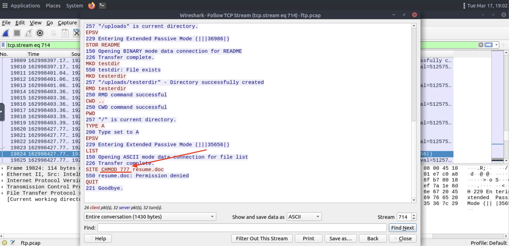

**Answer: CHMOD 777**

## Task 7: Cleartext Protocol Analysis: HTTP

### HTTP Overview

HTTP (Hypertext Transfer Protocol) is used for communication between clients (like browsers) and web servers. Unlike HTTPS, HTTP traffic is sent in cleartext, meaning anyone monitoring the network can read the requests and responses.

This can include juicy stuff like:
- URLs  
- form data (usernames, passwords, comments)  
- headers and cookies  

So HTTP is a goldmine during traffic analysis — sensitive information can often be extracted directly from the packets

In this section, we’ll analyze HTTP traffic to identify user activity and extract useful data from cleartext communications

### Investigate the user agents. What is the number of anomalous  "user-agent" types?

Filtering for user-agents with: http.user_agent   
reduces the number of visible packets from 54 to 53  

So we're gonna apply the user-agent field as a column as this will allow us to easily sift through the different user-agents 

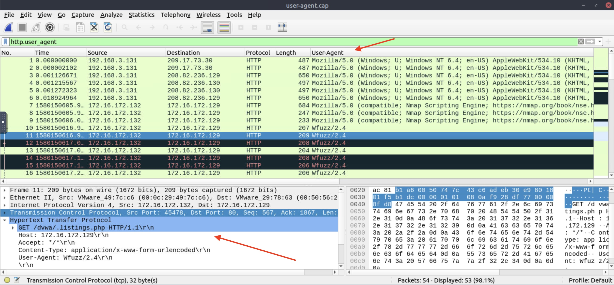

**Answer: 6**

### What is the packet number with a subtle spelling difference in the user agent field?

There isn’t much that filters can do here, nor is there much we can do other than look at each individual packet until we find the answer

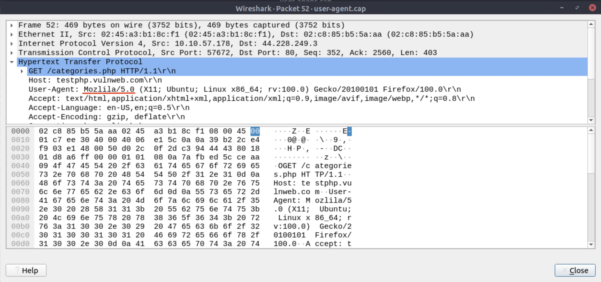

**Answer: 52**

### Locate the "Log4j" attack starting phase. What is the packet number?

The task, once again, basically gives us the answer

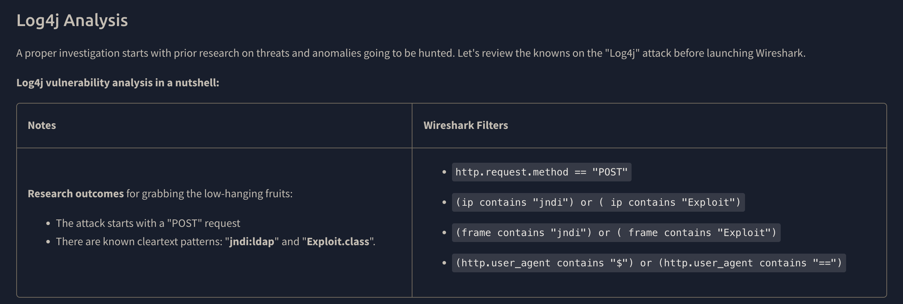

we just need to take all these individual filters and combine them in a single filter:  
http.request.method=="POST" and ((ip contains "jndi") or (ip contains 
"Exploit")) and ((frame contains "jndi") or (frame contains "Exploit")) and 
((http.user_agent contains "$") or (http.user_agent contains "=="))  

Only one packet is returned

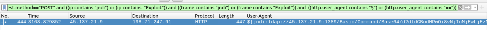

**Answer: 444**

### Locate the "Log4j" attack starting phase and decode the base64 command. What is the IP address contacted by the adversary? (Enter the address in defanged format and exclude "{}".)

On the same packet, right-click Hypertext Transfer protocol at the bottom, and go to Follow -> TCP Stream  

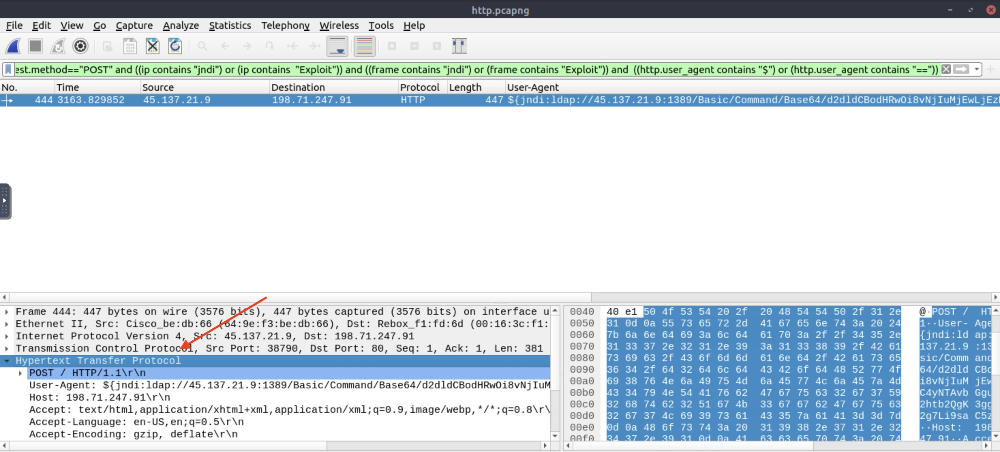

The answer is in the string following /Base64

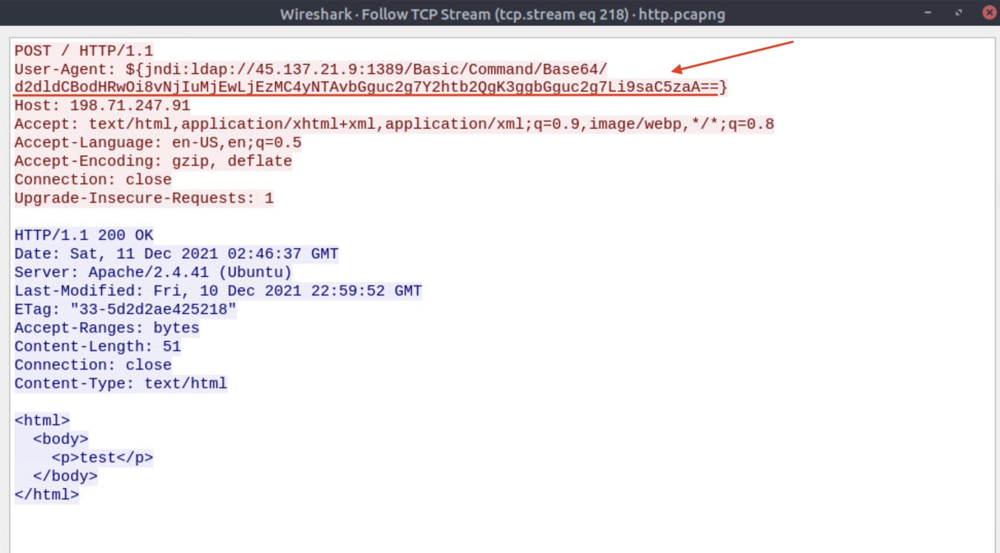

Let's bake it using Cyberchef 

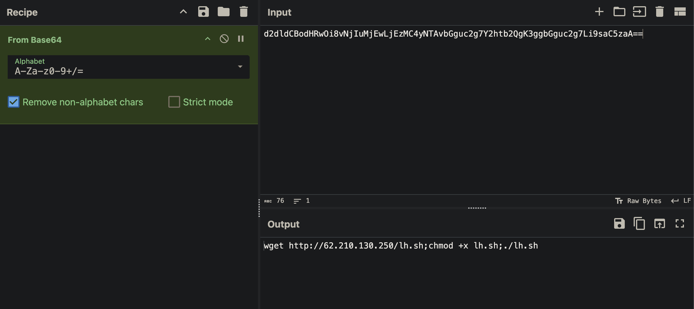

This is quite interesting – the string tells us someone used wget to download and run a script  
We change the cyberchef formula to defang the IP address we found 

**Answer: 62[.]210[.]130[.]250**

## Task 8: Encrypted Protocol Analysis: Decrypting HTTPS

### What is the frame number of the "Client Hello" message sent to "accounts.google.com"?

We start by filtering using:  
(http.request or tls.handshake.type == 1) and !(ssdp) and frame contains "accounts.google.com"

This filter shows HTTP requests and TLS Client Hello messages while excluding SSDP traffic, and narrows the results to packets containing "accounts.google.com"  
This allows us to focus on traffic related to that domain, including the initial TLS handshake where the client indicates the server it wants to reach 

Only one packet is returned  

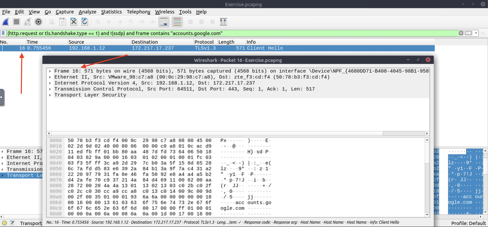

**Answer: 16**

### Decrypt the traffic with the "KeysLogFile.txt" file. What is the number of HTTP2 packets?

As per the task, we need to apply the key log file to decrypt the encrypted traffic, and the task provides the steps to do so 

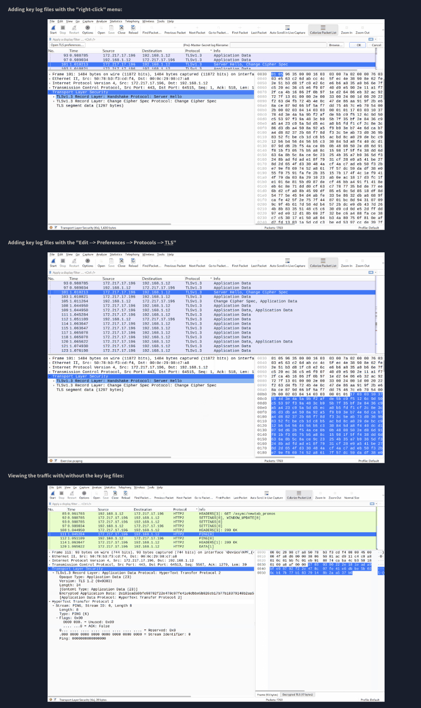

For some reason the number of packets we get when applying the key (119) isn't correct – I have no idea why  
Fortunately, it doesn't take much effort to weed out the irrelevant ones: filter by http2 

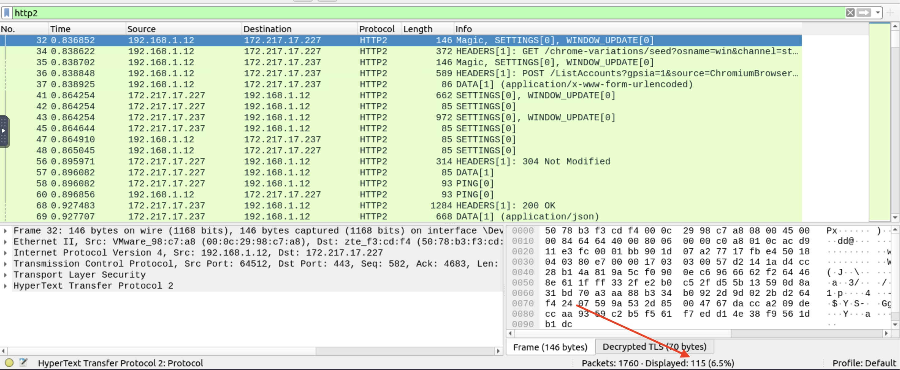

**Answer: 115**

### Go to Frame 322. What is the authority header of the HTTP2 packet? (Enter the address in defanged format.)

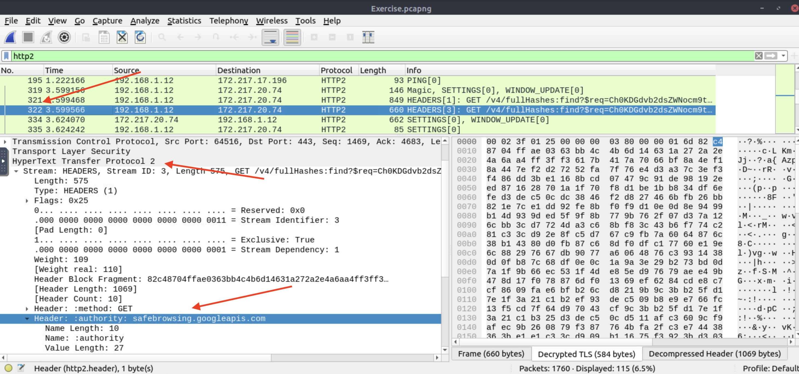

**Answer: safebrowsing[.]googleapis[.]com**

### Investigate the decrypted packets and find the flag! What is the flag?

My first instinct is to filter by request:    
(http.request or tls.handshake.type == 1) and !(ssdp)  

23 packets displayed – most of them are client hello ones, but there's a few at the bottom that look interesting  

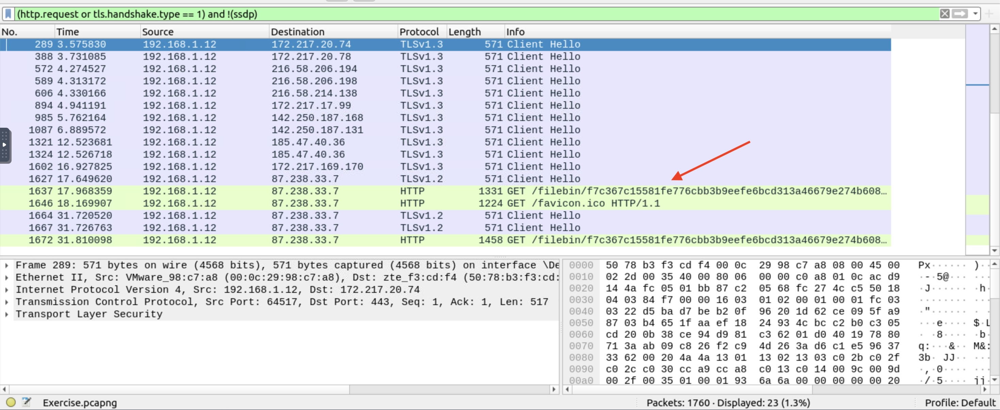

Double-click packet 1637 –> Follow –> TLS Stream 

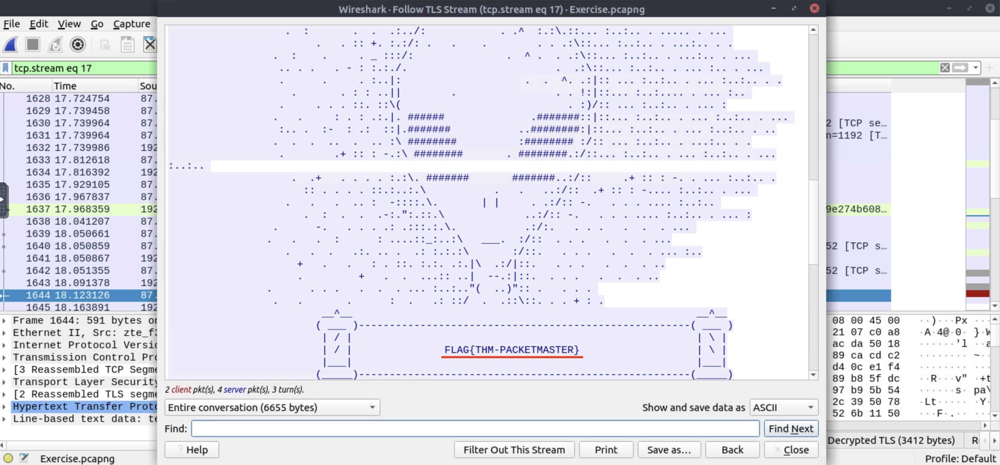

**Answer: FLAG{THM-PACKETMASTER}**

## Task 9: Bonus: Hunt Cleartext Credentials!

### Use the "Desktop/exercise-pcaps/bonus/Bonus-exercise.pcap" file. What is the packet number of the credentials using "HTTP Basic Auth"?

Filtering for http traffic returns two packets:    
http

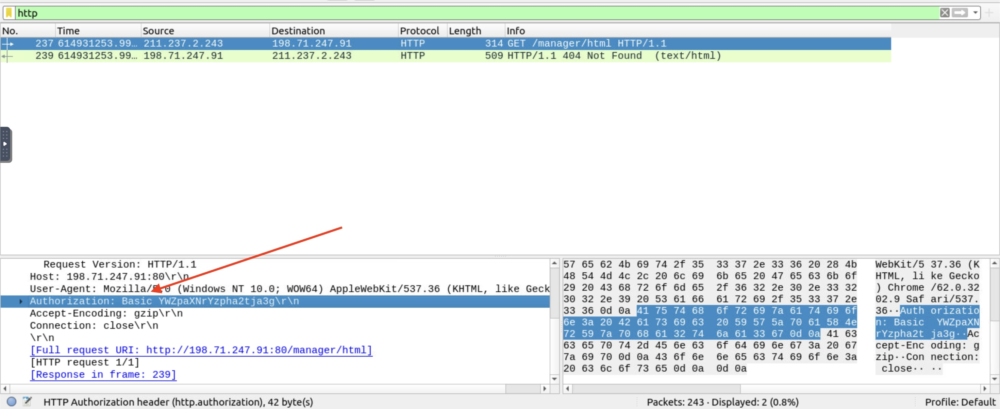

The relevant packet contains the HTTP Basic Authentication credentials  
easy peasy  

**Answer: 237**

### What is the packet number where "empty password" was submitted?  

The protocol has to be FTP, as we know from the previous task that there is only one HTTP packet using authentication  
So we filter for FTP traffic with:  
ftp  

Now it's just a matter of manually sifting through the packets  

You quickly notice that packets without a password lack the "Request arg" field, which is present in those that include one  

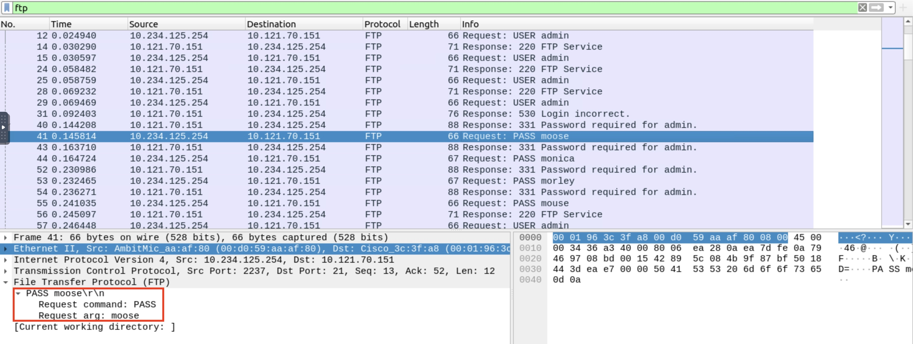

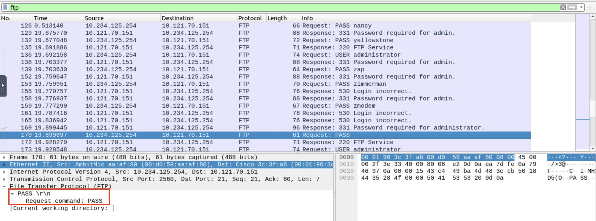

We can set a filter to include said "arg" field, and one for packets that request a password. We also want a "not" field to include packets that do not have this option:  
ftp and ftp.request.command and !ftp.request.arg  

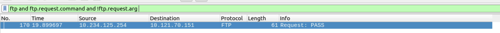

We get exactly one packet  

**Answer: 170**

## Bonus: Actionable Results! 

### Use the "Desktop/exercise-pcaps/bonus/Bonus-exercise.pcap" file. Select packet number 99. Create a rule for "IPFirewall (ipfw)". What is the rule for "denying source IPv4 address"?

For this one, we need to go to Tools –> Firewall ACL Rules –> IPFirewall (ipfw):

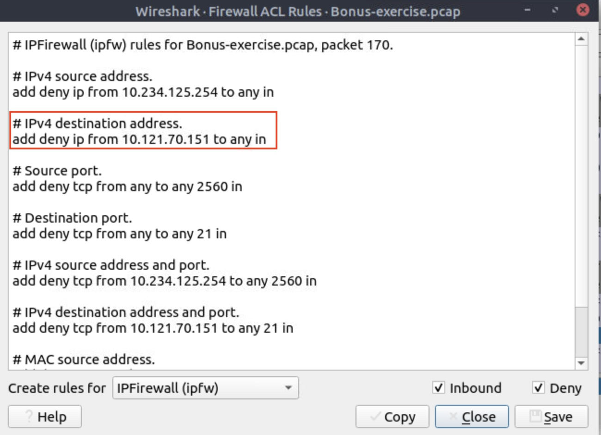

**Answer: add deny ip from 10.121.70.151 to any in**
